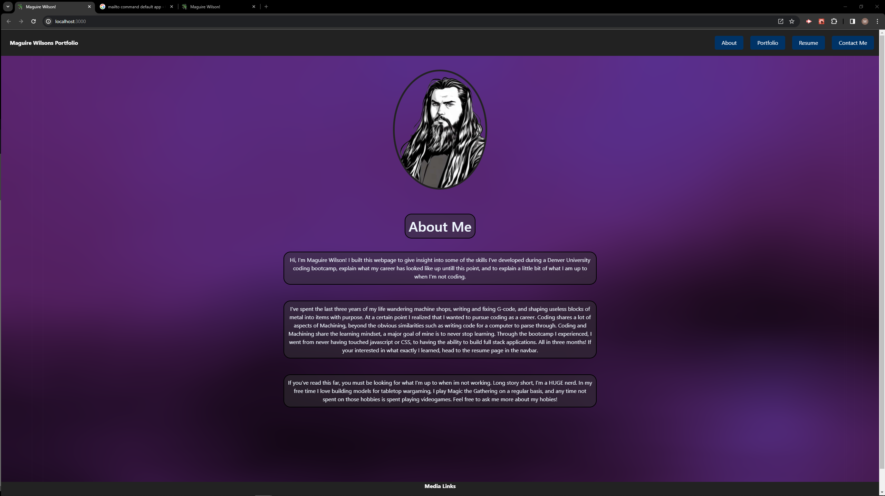

# Mwilson-Portfolio#

## Table of Contents

- [Description](#description)
- [Installation](#installation)
- [Contributing](#contributing)
- [Usage](#usage)
- [Tests](#tests)
- [Questions](#questions)
- [Links](#links)
- [Screenshot](#screenshot)

## Description

This is my Portfolio!

## Installation

Clone the code to an empty file from the GitHub page, in terminal run the command "npm run install". The dependencies will be installed onto your machine. Then run "npm run build" to build out the DIST!

## Contributing

Maguire Wilson

## Usage

In terminal run the command "npm run start" and open the application on http://localhost:3000/.
application can aslo be accessed live at https://jate-pwa-mwilson-d321b33ed84e.herokuapp.com/

## Tests

There are no formal tests for this application.
After running the command "npm run start", then view functionality and look at the resuts to decide if there are any errors, if you have errors and can't solve them yourself feel free to contact me.

## Questions

Additional questions?
You can find me [HERE](https://github.com/MacroWil) on GitHub.
Or, you can email me at macrow.co@gmail.com.

## Links

Link to Deployed application [HERE](https://jate-pwa-mwilson-d321b33ed84e.herokuapp.com/)

## Screenshot

